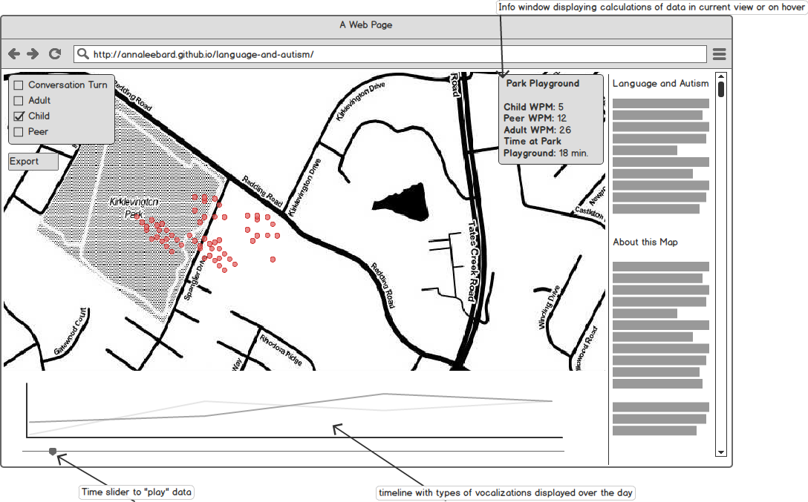
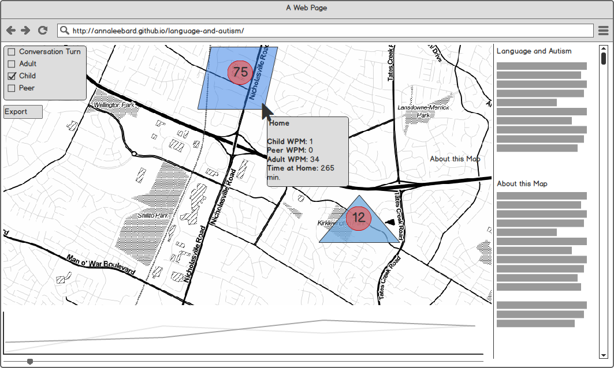

## Language Environments of Young Children with Autism
Rich language environments are crucial in language and social communication development for children with autism spectrum disorder (ASD). Children’s participation in community activities and adult vocalizations received while in the community are particularly effective in positively impacting development. This map visualizes the language environment of a child with ASD as she experiences activities throughout a typical day with her family. The map clusters language activity and retrieves information on language clusters with user interaction. Language data resymbolizes at different scale intervals revealing patterns and details in the child's language experience. Mapping the language experience of children with ASD assists in understanding and developing interventions toward boosting social communication development. 
###What do our users want to get out of the project?
- View calculations per activity or location of adult vocalizations per minute, child vocalizations per minute, and peer vocalizations per minute.
- Learn how children with ASD experience language in community activity environments. 
- For example, if a child spends one hour in the park playing then one hour grocery shopping with a parent our user would like to see how the language data of each activity compare. 
- See daily timeline of child vocalizations and received language

###Scenario:
Sarah has dedicated her career to researching language environments of children with autism spectrum disorder. She knows that helping create rich language environments for kids with ASD can affect autism severity and language ability. Sarah and her research team have used a LENA language processing device and Qstarz GPS device to capture language and location data and a web map has been developed to visualize the data. The map captures the language data generated by one child throughout the course of their day in the community. Sarah is familiar with exploring her data via print maps and is somewhat familiar with thematic web maps.

The map loads and clusters displays 5 major clusters, she understands these are the 4 places the child experienced significant language on the given day. These places will be categorized as the child’s home, another residence, or the location of community activity. Sarah is excited to see her piles of data come to life! She hovers over a cluster which displays a polygon representing the space the language was received and an info box with details of adult vocalizations in that space. Below the map she views a timeline of the data with a y-axis metric displaying adult vocalizations. Sarah notices radio buttons which upon selection add/remove other language data layers including vocalizations of the child and vocalizations of the child’s peers. Sarah zooms in to reveal circle markers symbolized by hue to indicate categories of vocalization. Sarah can quickly see where the child is receiving language and where the child is vocally interacting with caregivers, family members, and friends. She can begin to document these findings in new ways and developed specific strategies to boost language development. 

###Alternate Scenario: 
Parent of a child participating in the LENA – GPS language and location recording research is interested in results of the data collection they contributed.

##Data Source:
Pilot data available on typical developing kid, currently collecting data in the community which may be available. Data initially available as a csv with latitude and longitude points. Unfortunately data has been collected on a one second metric so various forms of data aggregation must be explored to ensure meaningful visualization. Each second recorded includes latitude, longitude, adult vocalization count, peer vocalization count, conversation “turn” count, child (the child wearing the device) count, speed, heading, and average word count.

##Technology Stack:
- QGIS and OpenCalc for cleaning table headings and unnecessary data
- CSV is likely to be chosen format, other light file formats to be considered 
- Mapbox and MarkerClusterGroup or Leaflet and Leaflet.markercluster plugin
- Anticipate D3 implementation for timeline
- HTML and CSS to create custom styles and deliver metadata
- Initially hosted using GitHub pages 
Thematic Representation:
Anticipate dot map representation of symbols with integration of dynamic marker clusters with polygon on hover representing extent of clustered markers. Further development to include point level data animation to be considered.

##Content Requirements:
- Language data will be represented as circle markers or “dots” for each vocalization recorded
- Point level data will resymbolize as marker clusters at small scale zoom (converse holds true)
- Data will be encoded based on who generated the vocalization ( child, peer, adult) and visualized by divergent hues 
- Info-window will display to provide user details of cluster or individual point (depending on current chosen scale)
- Data will be displayed on timeline to present temporal aspect of data in consumable format
- Side panel or “about this map” menu choice will provide succinct description of data and map concept 

##Description of anticipated UI:
- Input Control: 
	- Vertical list of checkboxes used to apply which type of vocalizations to display on map (check boxes employed here to allow more than one option to be selected)
	- Possible: Export button
- Navigational Components:
	- Zoom level buttons to change scale of map (restricted)
	- Pan options available but restricted to keep data visible to user
	- Timeline (may include slider to “play” data visualization)
- Informational Components:
	- Tooltips to help guide user implemented where needed
	- Info-window on click or hover to display data within marker cluster or data specific to point of vocalization if point level data is displayed
	- Side panel with scroll to provide context for map and data represented 

